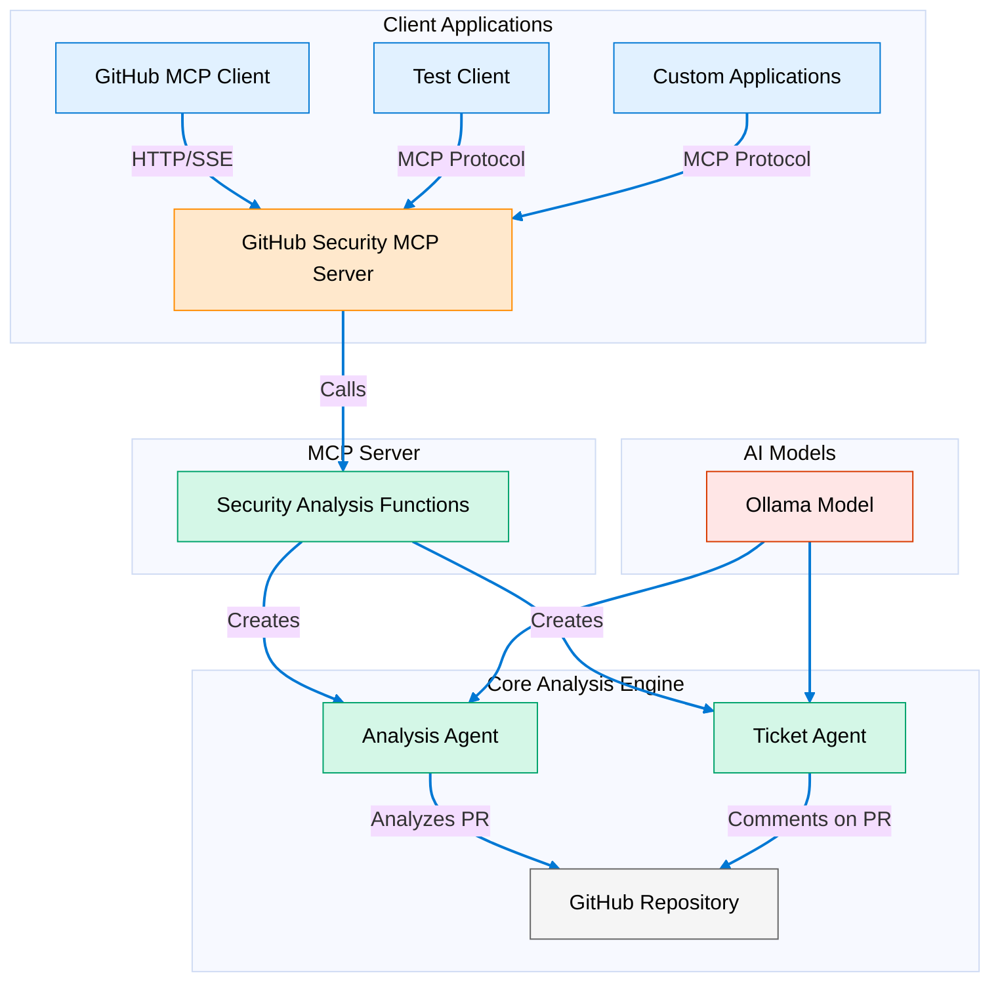

# GitHub Security Analysis Tool

A tool that automatically analyzes GitHub pull requests for security vulnerabilities and provides recommendations.

## Overview

This project uses AI agents to:
1. Analyze pull requests in a GitHub repository
2. Identify potential security risks
3. Generate security recommendations
4. Comment on pull requests with findings

## Architecture



## Components

- **Analysis GitHub Agent**: Examines pull request changes for security issues
- **Ticket Agent**: Creates comments on pull requests with security recommendations
- **GitHub Security MCP Server**: Exposes security analysis functionality via Model Context Protocol
- **GitHub MCP Client**: Connects to the MCP server to request security analysis
- **Agent UI**: Modern chat interface for interacting with the agents

## Setup

### Prerequisites

- Python 3.8+
- Node.js 14.21.3+
- Ollama server running
- GitHub access token
- FastMCP library (for MCP server)
- MCP client library (for MCP clients)

### Installation

1. Clone the repository
2. Create a `.env` file in the root directory with:
   ```
   GITHUB_TOKEN=your_github_token
   ```
3. Install Python dependencies:
   ```bash
   pip install -r requirements.txt
   ```
4. Install UI dependencies:
   ```bash
   cd agent-ui
   pnpm install
   ```

## Usage

### Running the Security Analysis Directly

```bash
python src/minimal_github.py
```

This will:
- Fetch the latest pull request from the configured repository
- Analyze it for security vulnerabilities
- Generate a security report
- Post findings as a comment on the pull request

### Running the MCP Server

```bash
python src/mcp-servers/github_security_mcp_server.py
```

This starts the MCP server on port 8080 using SSE transport.

### Using the MCP Client

```bash
python src/github_mcp_client.py
```

This connects to the MCP server and requests a security analysis of a GitHub repository.

### Running the Agent UI

```bash
cd agent-ui
pnpm dev
```

Access the UI at http://localhost:3000

## Configuration

- Edit `src/minimal_github.py` to configure:
  - Target repository
  - Model settings
  - Agent instructions
- Edit `src/github_mcp_client.py` to configure:
  - Target repository
  - MCP server URL

## How It Works

1. The MCP server exposes the security analysis functionality as a tool via the Model Context Protocol
2. Clients connect to the server using the MCP client library
3. The server processes requests by calling the core security analysis functions
4. The analysis functions create AI agents that interact with GitHub
5. Results are returned to the client via the MCP protocol

## License

This project is licensed under the MIT License.
